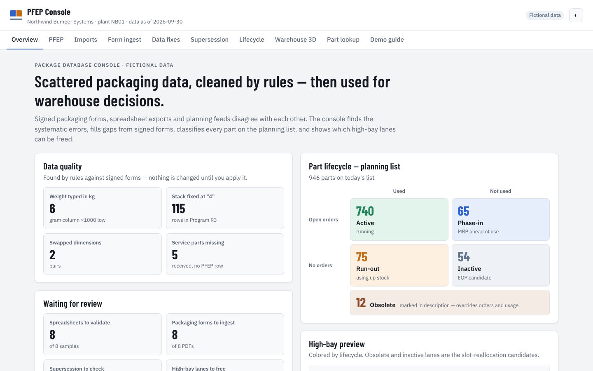
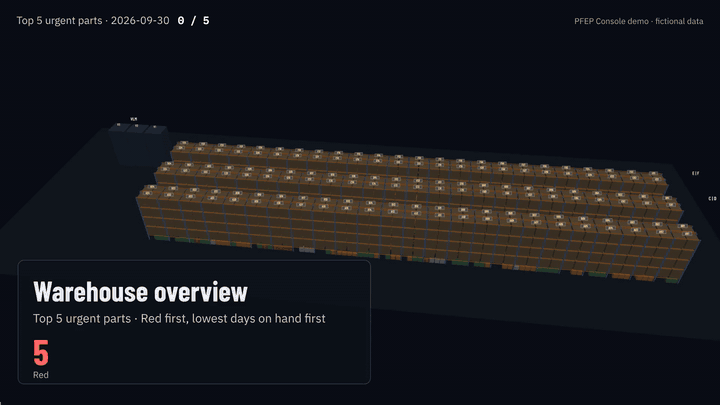
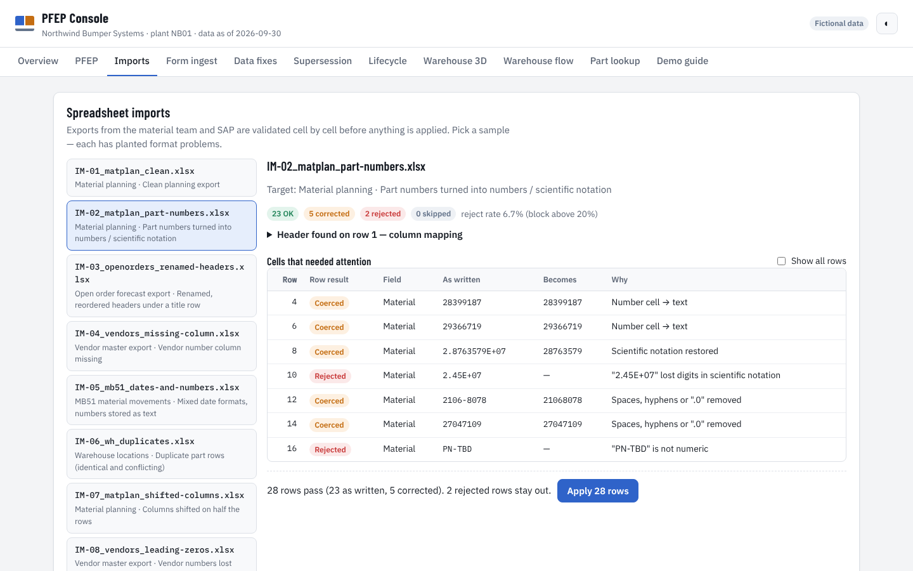
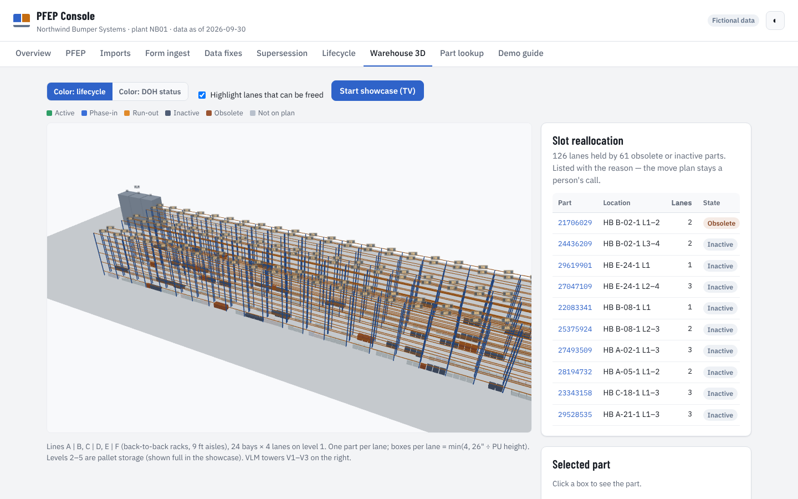
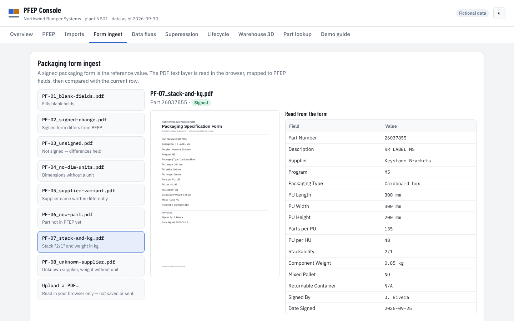
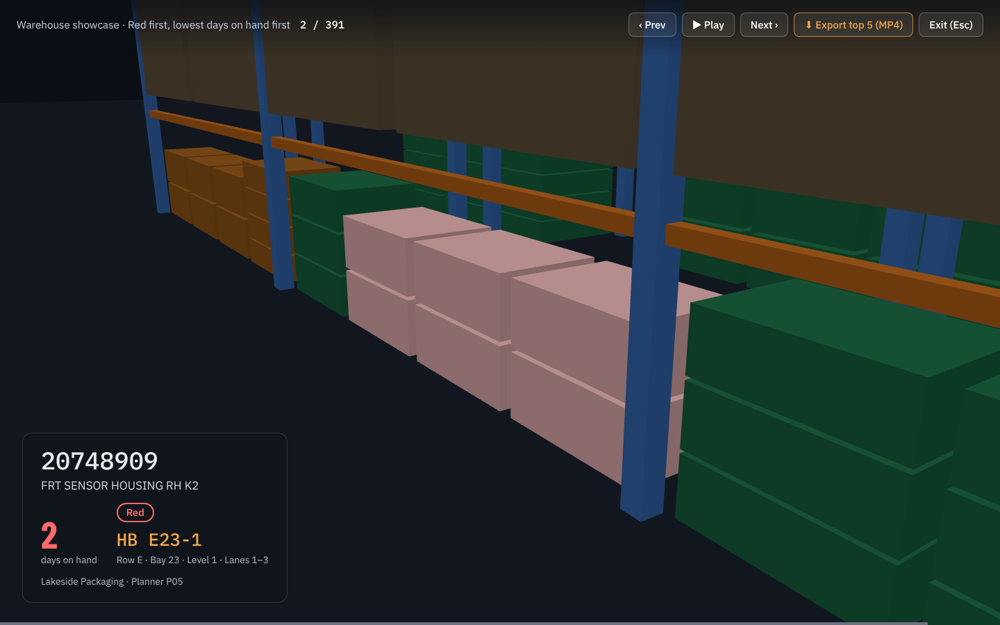

# Package Database Console (PFEP) — demo

**Live demo:** https://leglsm.github.io/pfep-console-demo/ · static web page, fictional data, no login

A portfolio rebuild of a working tool I built at an automotive exterior-parts plant (current role, Supply Chain Engineer); the requirements came from my manager and the material handlers on the floor. It keeps one package database — PFEP, *plan for every part* — honest when the inputs disagree: signed packaging forms, SAP exports and spreadsheets from the material team. Then it uses the cleaned data for two decisions: which parts are still alive, and which high-bay lanes can be freed.

▶ [Full 51-second clip (MP4)](https://leglsm.github.io/pfep-console-demo/docs/showcase-top5.mp4) — the showcase's *Export top 5*, rendered from the demo data.

## Problem
- Packaging data lived in **signed supplier forms, SAP exports and spreadsheets** that disagreed with each other.
- Launch-time hand entry left **systematic errors**, not typos: part weight typed in kg into a gram column (1,000× too light), one trailer stack value stamped across a whole program, two parts holding each other's dimensions. These skew trailer and warehouse planning.
- Spreadsheets arrived **damaged by Excel**: part numbers turned into numbers or scientific notation, vendor numbers without their leading zeros, renamed or reordered headers, dates in mixed formats, duplicate rows.
- **Service parts** had no form and no PFEP row. During changeovers, **old and new part numbers** were both alive, and nobody could say quickly which parts were still running.

## Approach
- **Signed form is the reference value.** Read the form, map it to PFEP fields (stack "2/1" → 3, kg → g, YES/NO → Mixed/Homogeneous HU, supplier name → vendor code), then fill blanks, overwrite and report differences on a signed form, and hold anything unsigned or unclear.
- **Validate every spreadsheet before it lands.** Each cell comes back **OK**, **Coerced** (corrected, with the reason) or **Rejected** (left out). A missing required column, or more than 20% rejected rows, blocks the whole file.
- **Read supersession (SQ01) as lineage, not status.** Follow old → new over several hops; a fork takes the newer link, a same-day tie or a loop goes to a person. Sync blank fields both ways after a preview.
- **Classify every part on the planning list.** Obsolete wording first (including typos such as OBSL), then open orders × usage in the last 30 days → Active / Phase-in / Run-out / Inactive. Receipts are not usage.
- **Use it in the warehouse.** Lanes held by obsolete or inactive parts are the slot-reallocation candidates; a full-screen showcase for the office TV opens on the whole warehouse, then flies to each Red part (lowest days on hand first) and can export the top five as a video clip.

## Result
- Reported the **part-lifecycle 2×2** to my manager.
- Answered colleagues' and material handlers' **"where is it / is it still alive / how is it packed?"** on the spot.
- When a **slot reallocation** was requested, the lanes that could be freed were already listed.

## Try the demo
| Scenario | Where | What to look for |
|---|---|---|
| S1 What is wrong with the data? | Overview | Error counts and the lifecycle 2×2; every card drills in |
| S10 Validate a spreadsheet | Imports | IM-02: part numbers as numbers / scientific notation — `2.51E+07` lost digits and is rejected. IM-07: half the rows shifted → whole file blocked |
| S2 Ingest a signed form | Form ingest | PF-07: "2/1" → 3, 0.85 kg → 850 g. PF-02 signed and different → overwritten and reported. PF-03 unsigned → held. PF-04 no units → kept as written until you confirm inches |
| S3 Fix systematic errors | Data fixes | kg in the gram column, stack fixed at "4", swapped dimensions — only rows backed by a signed form change |
| S4 Service parts without a form | Data fixes | Tier A match to a service part → added and tagged; Tier A match to a production part → not added |
| S5 Old → new part numbers | Supersession | Three-hop chain, fork by date, same-day tie, loop; review → apply sync |
| S6 Is it still alive? | Lifecycle | Obsolete override, the four quadrants, parts that joined or left the planning list today |
| S7 Free up high-bay lanes | Warehouse 3D | Highlighted lanes and the candidate list; click a row to fly to it |
| S8 Answer a floor question | Part lookup | One part number across every source, with mismatches marked; *Show in 3D* flies to its lane or VLM tray |
| S9 Office TV | Warehouse 3D → *Start showcase* | Opens on the whole warehouse with status counts; per part: back to the bird's-eye view → 360° orbit of its row → down into the aisle → hold. ‹ Prev · Pause · Next ›, keys ← Space →, Esc. *Export top 5* saves an MP4/WebM clip |

| Spreadsheet validation | High-bay, slot candidates highlighted |
|---|---|
|  |  |
| **Signed form ingest** | **TV showcase** |
|  |  |

## Design decisions
- **Signed form wins** — a different value on a signed form overwrites and is reported; unsigned or malformed values are held.
- **Never guess a unit** — a dimension without a unit stays as written until a person confirms it.
- **Reject, don't guess** — a cell that cannot be read safely is rejected; a high reject rate means the columns are probably shifted, so the file is blocked.
- **Blank is not always missing** — an empty returnable-container field means one-way packaging, so it is never "filled" from a partner part.
- **SQ01 is lineage, not status** — old numbers stay visible; status comes from orders and usage.
- **Receipts are not usage** — only consumption movements count, and "no open orders" needs three weekly snapshots in a row.
- **Quantity is lanes** — one part per lane; boxes per lane = min(4, 26" level height ÷ PU height).
- **Review, then apply** — every rule produces a preview; nothing changes until you press apply.
- **The camera never goes through a rack** — it climbs above the rack tops before crossing, then drops straight into the aisle; a test counts frames with the camera inside a rack (must be 0).

## Real vs demo
| | In the plant | In this demo |
|---|---|---|
| Data | Plant SAP exports, signed supplier forms | Fixed-seed fictional data — every company, person and part number is invented |
| Storage | Server database | Your browser only; changes reset after 6 hours |
| Spreadsheets | Uploaded as they arrive | Eight built-in samples with planted format problems |
| Forms | Supplier PDFs | Eight sample PDFs; you can also upload one (read in the browser, never sent) |
| Thresholds | Plant settings | Red < 5 DOH, Orange > 22 DOH, usage window 30 days, 3 weeks of zero open orders |

Part numbers follow an SAP-style scheme (2… component, 45… finished bumper, 75… service/trading part, 6… returnable container) and are invented.

## How it is built
- `src/rules.js`, `src/validate.js` — pure rules (form mapping, conflicts, error detection, service-part matching, supersession, sync, lifecycle, slots, DOH, import validation); the same files run in Node tests and in the browser
- `src/seed.js` — fixed-seed fictional plant with the planted cases listed in `PLANTED`
- `src/state.js` — one `store` adapter (browser storage, memory fallback); applied changes are saved as batches and replayed
- `src/warehouse3d.js` — three.js high-bay and VLM towers (instanced boxes, picking, camera moves on a pausable clock); `src/showcase.js` — TV showcase, single-part view and clip export; `src/pdf-parse.js` — pdf.js text layer
- `lib/` — pinned copies of pdf.js 4.10.38, three.js r170 and SheetJS 0.18.5 (with their licenses); no build step, no CDN
- `tools/` — generators for the sample PDFs and spreadsheets, a de-identification check, and `make-video.py` (renders the showcase clip frame by frame on a manual clock, then ffmpeg)
- `npm test` — 20 rule tests · `npm run e2e` — 44 browser checks (all scenarios, phone width, dark theme, console errors)

All data is fictional. No employer data or names are used. Built by [Daniel Lee](https://leglsm.github.io/portfolio/).
